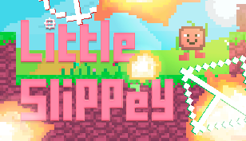

## Little Slippey Arcade Game Repository
Brief description: Dodge tons of missiles flying at you. Train your reaction, memorize map structures, and adapt to constantly changing rules on them.

---

The game is developed on the Godot engine for Desktop platforms.

The main branch for the HTML5 version has a historical name related to early plans for a browser version. Currently, the game is oriented only towards Desktop.

The game is released in early access and is in a playable and completable state. Further development of secondary content is currently frozen due to time reallocation to studies and other projects.

---

Steam page link: [https://store.steampowered.com/app/3288650/Little\_Slippey/](https://store.steampowered.com/app/3288650/Little_Slippey/?referrer=grok.com)

If you want to build the game from source code or modify something in it, you will need Godot Engine 4.4 and (optionally) a code editor, such as Visual Studio or VS Code with appropriate extensions for working with Godot.

To open the project in Godot, scan the directory where you moved the unpacked Little-Slippey-game-HTML5-version folder from the archive. The project should appear in the list.